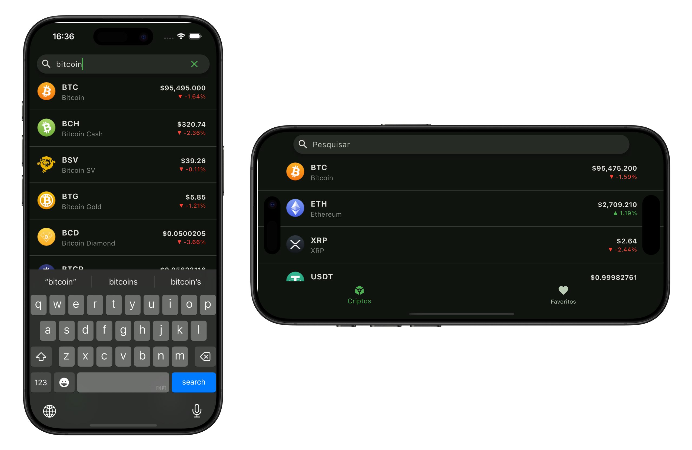

# 📊 Aplicativo de Criptomoedas

Este aplicativo exibe informações sobre criptomoedas, permitindo visualizar dados e detalhes relevantes de cada uma. Ele foi desenvolvido em **Flutter**, utilizando **MVVM** como arquitetura.

## 📸 Capturas de Tela




## 🚀 Tecnologias Utilizadas

- **Linguagem:** Dart
- **Framework:** Flutter
- **Arquitetura:** MVVM
- **Padrão de UI:** Atomic Design (atoms, molecules, organisms, templates)
- **Gerenciamento de estado:** Bloc

## 📂 Estrutura do Projeto

O projeto segue uma estrutura modularizada:

```
/lib
 ├── app
 │   ├── models              # Modelos de dados
 │   ├── repositories        # Gerencia dados (remoto ou local)
 │   ├── services            # Serviços e requisições HTTP
 │   ├── viewmodels          # ViewModels (lógica de negócios e estado)
 │   ├── views               # Telas do aplicativo
 │   │   ├── atoms           # Elementos básicos (ex: botões, textos)
 │   │   ├── molecules       # Pequenos agrupamentos de átomos
 │   │   ├── organisms       # Componentes mais complexos
 │   │   ├── pages           # Páginas de tela
 ├── core
 │   ├── shared              # Componentes compartilhados (AppBar, BottomNavigationBar, etc.)
 │   ├── utils               # Utilitários e funções auxiliares
 │   ├── constants           # Constantes globais do app
```

## 🛠 Dependências Externas

As seguintes bibliotecas foram utilizadas no projeto:

```yaml
dependencies:
  http: ^1.3.0
  web_socket_channel: ^3.0.2
  shared_preferences: ^2.5.2
  freezed: ^2.5.8
  freezed_annotation: ^2.4.4
  json_annotation: ^4.9.0
  get_it: ^8.0.3
  cached_network_image: ^3.4.1
  flutter_bloc: ^9.0.0
  equatable: ^2.0.7
  intl: ^0.20.2
  fl_chart: ^0.70.2

dev_dependencies:
  build_runner: ^2.4.15
  json_serializable: ^6.9.4
```

## 📌 Instruções para Execução

### Pré-requisitos

Certifique-se de ter instalado:

- **Flutter** ([https://flutter.dev/docs/get-started/install](https://flutter.dev/docs/get-started/install))
- **Dart**
- **Emulador ou dispositivo físico**

### Como rodar o projeto

1. Clone o repositório:

   ```bash
   git clone https://github.com/origemjhanpoll/flutter_crypto_test
   cd flutter_crypto_test
   ```

2. Instale as dependências:

   ```bash
   flutter pub get
   ```

3. Execute o aplicativo:

   ```bash
   flutter run
   ```

_(Para rodar no iOS, é necessário um Mac com Xcode instalado.)_

## 🤝 Contribuição

Sinta-se à vontade para abrir issues ou contribuir com melhorias!

## 📄 Licença

Este projeto está sob a licença MIT.
